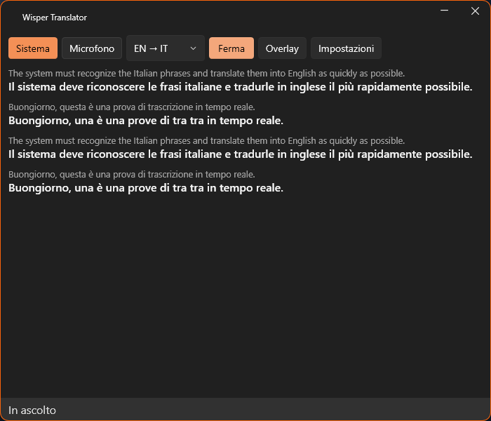

# Wisper Translator

Trascrizione e traduzione **in tempo reale** e **in locale** dell'audio del PC e del microfono, con
sottotitoli in una finestra flottante su Windows. Italiano ↔ inglese.




## Cosa fa

- Cattura l'**audio di sistema** (loopback WASAPI) e/o il **microfono**, con accensione indipendente.
- Trascrive in locale con Whisper (`whisper.cpp`): nessun audio lascia il PC.
- Traduce in locale con i modelli Firefox/Bergamot: circa **25 ms per frase**, nessuna chiave API.
- Mostra le battute in un **widget flottante** (nuova in alto, le vecchie scorrono in basso, fino a 20)
  e in un **overlay a schermo intero**, trasparente e cliccabile-attraverso.
- Salva lo storico delle sessioni con **retention di 5 giorni** ed esporta in **SRT**, testo o JSON.
- Gestisce i modelli: download con verifica SHA-256, ripresa, verifica integrità, import locale,
  eliminazione.

## Requisiti

- Windows 10/11 a 64 bit.
- 4 GB di RAM liberi (i modelli piccoli girano anche su CPU senza GPU dedicata).
- ~700 MB di disco per il programma e ~250 MB per i modelli.
- Connessione a internet **solo** per il primo download dei modelli.

## Installazione

1. Scarica `WisperTranslator-Setup-x.y.z.exe` dalle release.
2. Esegui l'installer (non richiede diritti di amministratore).
3. Al primo avvio premi **Avvia**: i modelli mancanti vengono scaricati automaticamente in base
   all'hardware rilevato.

## Uso

| Comando | Effetto |
|---|---|
| **Sistema** | attiva/disattiva l'audio riprodotto dal PC |
| **Microfono** | attiva/disattiva l'ingresso del microfono |
| **IT → EN / EN → IT** | direzione della traduzione (deve corrispondere alla lingua parlata) |
| **Avvia / Ferma** | apre le sorgenti audio e comincia l'ascolto |
| **Overlay** | mostra i sottotitoli a tutto schermo |
| **Impostazioni** | aspetto, modelli, dispositivi e storico |

### Scorciatoie da tastiera

| Scorciatoia | Effetto |
|---|---|
| `Ctrl+Alt+W` | mostra/nascondi il widget |
| `Ctrl+Alt+S` | audio di sistema on/off |
| `Ctrl+Alt+N` | microfono on/off |
| `Ctrl+Alt+L` | inverti la direzione |
| `Ctrl+Alt+O` | overlay on/off |

### Dove stanno i dati

Tutto in `%LOCALAPPDATA%\WisperTranslator`:

| Percorso | Contenuto |
|---|---|
| `models\` | modelli scaricati |
| `history.db` | storico delle sessioni (SQLite) |
| `exports\` | esportazioni da riga di comando |
| `settings.json` | preferenze |
| `audio-dump\` | registrazioni di prova, se richieste |

## Privacy

Con i motori locali (impostazione predefinita) audio e testo **non escono dal computer**: la traduzione
parla con un server locale (`127.0.0.1`) incluso nel programma. Solo il download dei modelli e
l'eventuale motore cloud opzionale usano la rete, e il motore cloud è spento di default.

## Risoluzione dei problemi

| Sintomo | Causa probabile | Rimedio |
|---|---|---|
| Nessun testo | sorgente sbagliata | controlla il pulsante **Sistema**/**Microfono** e la direzione |
| "Hotkey non disponibili" | un altro programma usa la stessa combinazione | cambia programma o ignora: il resto funziona |
| Il microfono risente delle casse | il microfono capta l'audio degli altoparlanti | usa le cuffie o disattiva una delle due sorgenti |
| Download interrotto | rete instabile | rilanciare: riprende da dove era rimasto |
| Modello "hash diverso" | file scaricato male | `Impostazioni → Modelli → Elimina`, poi `Scarica` |

## Compilare da sorgente

```powershell
dotnet build                                  # compila
dotnet test                                   # 40 test
dotnet run --project src/WisperTranslator.Cli -- hardware
dotnet run --project src/WisperTranslator.Cli -- capture --seconds 15 --dump
dotnet run --project src/WisperTranslator.Cli -- live --seconds 20 --model base --lang it
dotnet run --project src/WisperTranslator.Cli -- translate --bench
dotnet run --project src/WisperTranslator.Cli -- models list
dotnet run --project src/WisperTranslator.Cli -- history list
```

Per creare l'installer:

```powershell
powershell -File installer/build.ps1
```

Il piano di sviluppo completo, le decisioni tecniche e i risultati misurati sono in
[PLAN.md](PLAN.md); i numeri di riferimento in [docs/BENCHMARKS.md](docs/BENCHMARKS.md).

## Licenza

MIT — vedi [LICENSE](LICENSE). I componenti di terze parti sono elencati in
[THIRD-PARTY-NOTICES.md](THIRD-PARTY-NOTICES.md).
