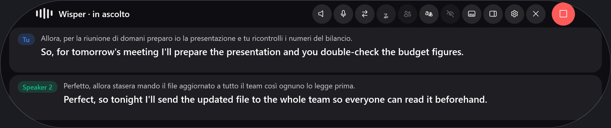
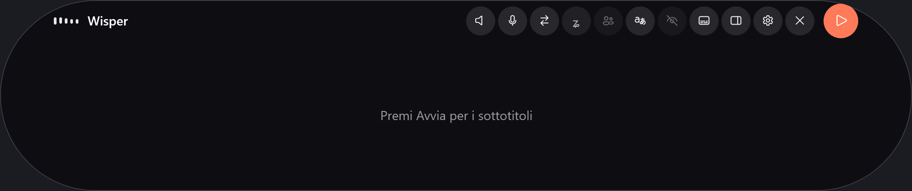
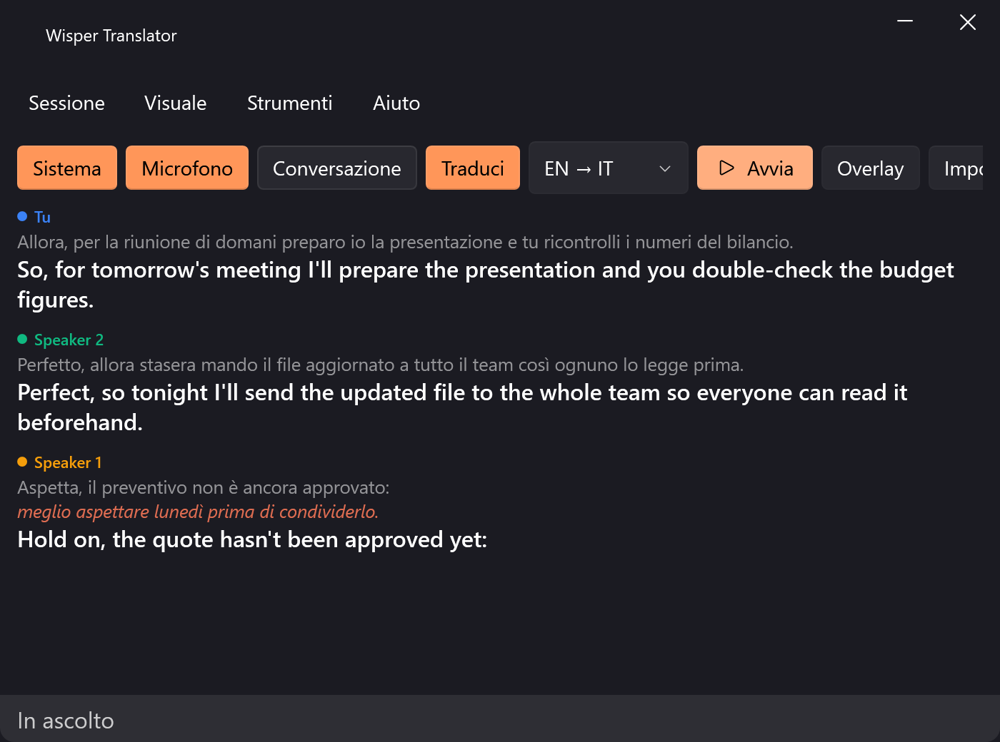
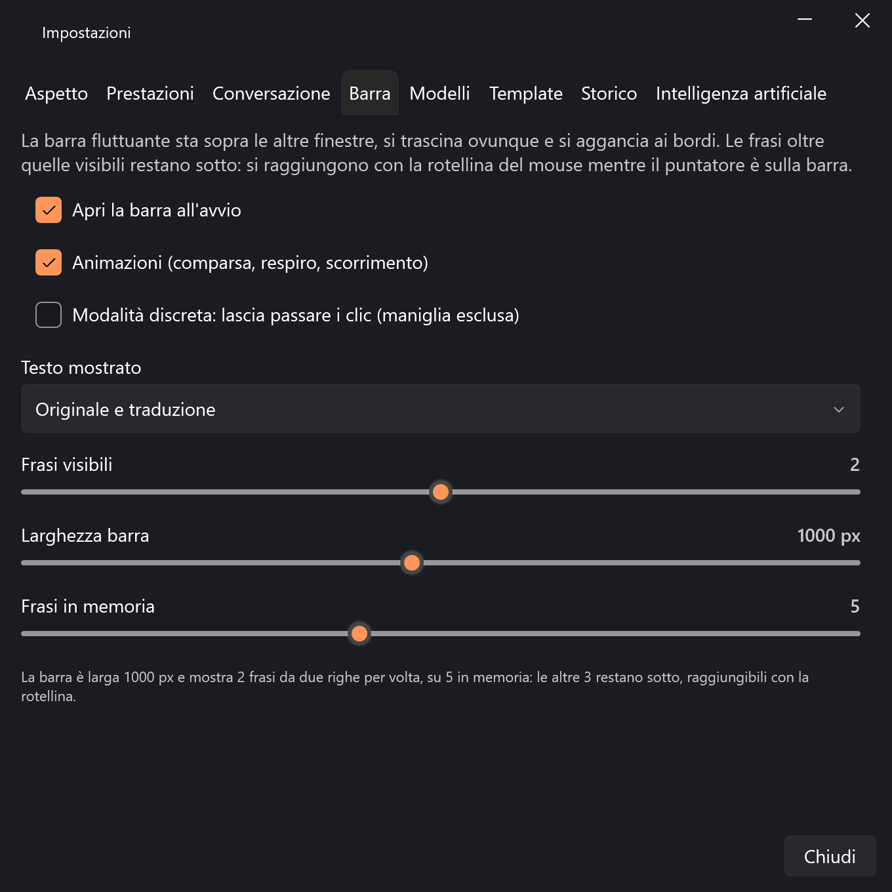

# Wisper Translator

Trascrizione e traduzione **in tempo reale** e **in locale** dell'audio del PC e del microfono, con
sottotitoli in una finestra flottante su Windows. Italiano ↔ inglese.









> Le immagini sono generate dal programma stesso (`WisperTranslator.App.exe --shot`) su frasi
> d'esempio: non contengono lo schermo del PC né dati di nessuno.

## Novità della versione 2.1

- **Barra ridisegnata in stile Apple**: capsula completamente arrotondata, **equalizzatore animato**
  che segue l'audio reale, **pulsante di stop corallo** sempre a portata, pulsanti circolari incassati
  che compaiono al passaggio del mouse, animazioni con effetto molla.
- **Più larga, per frasi intere**: 1000 px di default (480–1600 dallo slider o trascinando i bordi),
  ogni frase va a capo **fino a due righe** e non viene più troncata. Restano 2 frasi visibili su 5
  in memoria, con la rotellina per le altre.
- **Parlante come badge colorato** prima del testo (come nei riferimenti), testo provvisorio e
  correzioni **evidenziati in corallo** invece che in grigio.
- **Screenshot senza desktop**: il comando `--shot` disegna solo le finestre dell'app su uno sfondo
  neutro, quindi nelle immagini del README non finisce niente dello schermo.

## Novità della versione 2.0

- **Modalità conversazione**: nelle riunioni e nelle call il microfono resta **Tu** e l'audio di
  sistema viene diviso per parlante (`Speaker 1…8`, ognuno con il suo colore). Se in una frase si
  sentono due voci, la frase viene spezzata in due battute invece di mescolarle.
  Dettagli in [docs/CONVERSAZIONE.md](docs/CONVERSAZIONE.md).
- **Solo trascrizione o traduzione**: l'interruttore **Traduci** (pannello e barra) spegne la
  traduzione quando serve solo il testo.
- **Barra fluttuante in stile Apple** (`Wispr Flow`): acrilico di Windows 11, angoli arrotondati,
  trascinabile ovunque, si aggancia ai bordi, **2 frasi visibili** su **5 in memoria** (regolabili)
  con la rotellina per scorrere quelle sotto, comparsa con slide+fade, alone "in ascolto",
  controlli al passaggio del mouse e **modalità discreta** che lascia passare i clic.
- **Parlanti in tutto il programma**: etichetta nella barra e nel pannello, dettaglio sessione,
  esportazione **SRT** con `<v Speaker 1>`, JSON con il campo `speaker`, e nuova sezione PDF
  **Partecipanti rilevati** con battute, tempo di parola e quota di ciascuno.
- **Nuovi modelli in catalogo**: **Nemotron 3 Diarization** (107 MB, fino a 8 parlanti,
  OpenMDW-1.1) come predefinito e **Sortformer 4 parlanti v2** (147 MB, CC-BY-4.0) come alternativa.
- **Nuove schede nelle impostazioni**: **Conversazione** (diarizzatore, download, verifica, limiti
  dichiarati) e **Barra** (frasi visibili, frasi in memoria, testo mostrato, discreta, animazioni).

## Novità della versione 1.2

- **Impostazioni riorganizzate**: nuova scheda **Prestazioni** (profilo automatico o forzato, motore
  per corsia, stato dei componenti) e **valore sempre visibile** su ogni slider.
- **Motori selezionabili per fascia**: Vosk (leggerissimo, ~50 MB) sui PC minimi, **Nemotron 3.5
  streaming** (~708 MB) su quelli capaci, Whisper come rete di sicurezza.
- **14 template di mappe concettuali** (radiale, gerarchica, albero, linea del tempo, SWOT, spina di
  pesce, note colorate…) con orientamento, palette e densità regolabili: il modello scrive la
  struttura, **Graphviz** la disegna in locale (download di 9 MB al primo uso).
- **8 template di report PDF** (verbale di riunione, appunti di lezione, intervista, report tecnico,
  executive summary, trascrizione fedele, brainstorming, post-mortem) con copertina, indice, numeri
  di pagina e **mappa vettoriale** dentro il PDF.
- **Template importabili**: una cartella o uno zip con `template.json` oppure un `SKILL.md`
  (front-matter + istruzioni) diventa un template dell'app. I template sono file modificabili in
  `%LOCALAPPDATA%\WisperTranslator\templates`.
- **Storico a prova di errore**: un database danneggiato viene messo da parte e ricreato da solo
  (`wisper history check` per la diagnostica).

## Cosa fa

- Cattura l'**audio di sistema** (loopback WASAPI) e/o il **microfono**, con accensione indipendente.
- Trascrive in locale con Whisper (`whisper.cpp`): nessun audio lascia il PC.
- Traduce in locale con i modelli Firefox/Bergamot: circa **25 ms per frase**, nessuna chiave API.
- Mostra le battute in una **barra fluttuante acrilica** (nuova in alto, le vecchie scendono, le
  frasi oltre quelle visibili si raggiungono con la rotellina), nel **pannello esteso** e in un
  **overlay a schermo intero**, trasparente e cliccabile-attraverso.
- Nella **modalità conversazione** distingue chi parla: *Tu* per il microfono, `Speaker 1…8` per
  l'audio di sistema, anche in esportazione e nei report.
- Salva lo storico delle sessioni con **retention di 5 giorni** ed esporta in **SRT**, testo o JSON.
- Gestisce i modelli: download con verifica SHA-256, ripresa, verifica integrità, import locale,
  eliminazione.

## Requisiti

- Windows 10/11 a 64 bit.
- 4 GB di RAM liberi (i modelli piccoli girano anche su CPU senza GPU dedicata).
- ~700 MB di disco per il programma e ~250 MB per i modelli.
- Connessione a internet **solo** per il primo download dei modelli.

## Installazione

1. Scarica `WisperTranslator-Setup-x.y.z.exe` dalle release.
2. Esegui l'installer (non richiede diritti di amministratore).
3. Al primo avvio premi **Avvia**: i modelli mancanti vengono scaricati automaticamente in base
   all'hardware rilevato.

> **Avviso di Windows:** l'installer non è firmato digitalmente, quindi SmartScreen può mostrare
> "Windows ha protetto il PC". Per proseguire: *Ulteriori informazioni* → *Esegui comunque*.
> Il file è verificabile con l'hash SHA-256 pubblicato nella release.

## Uso

| Comando | Effetto |
|---|---|
| **Sistema** | attiva/disattiva l'audio riprodotto dal PC |
| **Microfono** | attiva/disattiva l'ingresso del microfono |
| **Conversazione** | separa le voci e dà un nome ai parlanti della call |
| **Traduci** | spento: trascrive soltanto, senza tradurre |
| **IT → EN / EN → IT** | direzione della traduzione (deve corrispondere alla lingua parlata) |
| **Avvia / Ferma** | apre le sorgenti audio e comincia l'ascolto |
| **Overlay** | mostra i sottotitoli a tutto schermo |
| **Impostazioni** | aspetto, modelli, dispositivi e storico |

### Scorciatoie da tastiera

| Scorciatoia | Effetto |
|---|---|
| `Ctrl+Alt+W` | mostra/nascondi il widget |
| `Ctrl+Alt+S` | audio di sistema on/off |
| `Ctrl+Alt+N` | microfono on/off |
| `Ctrl+Alt+L` | inverti la direzione |
| `Ctrl+Alt+O` | overlay on/off |

Nella **barra fluttuante** gli stessi comandi sono sui pulsanti che compaiono passando il mouse:
il pulsante **corallo a destra** avvia e ferma ed è sempre visibile; gli altri (sistema, microfono,
inverti direzione, testo mostrato, conversazione, traduci, modalità discreta, overlay, apri il
pannello, impostazioni, chiudi nella barra delle applicazioni) compaiono alla sua sinistra. Il testo
si trascina da qualsiasi punto della barra, che si allarga e si restringe **trascinando i bordi
laterali**.

### Dove stanno i dati

Tutto in `%LOCALAPPDATA%\WisperTranslator`:

| Percorso | Contenuto |
|---|---|
| `models\` | modelli scaricati |
| `history.db` | storico delle sessioni (SQLite) |
| `exports\` | esportazioni da riga di comando |
| `settings.json` | preferenze |
| `audio-dump\` | registrazioni di prova, se richieste |

## Privacy

Con i motori locali (impostazione predefinita) audio e testo **non escono dal computer**: la traduzione
parla con un server locale (`127.0.0.1`) incluso nel programma. Solo il download dei modelli e
l'eventuale motore cloud opzionale usano la rete, e il motore cloud è spento di default.

## Risoluzione dei problemi

| Sintomo | Causa probabile | Rimedio |
|---|---|---|
| Nessun testo | sorgente sbagliata | controlla il pulsante **Sistema**/**Microfono** e la direzione |
| "Hotkey non disponibili" | un altro programma usa la stessa combinazione | cambia programma o ignora: il resto funziona |
| Il microfono risente delle casse | il microfono capta l'audio degli altoparlanti | usa le cuffie o disattiva una delle due sorgenti |
| Due righe identiche in conversazione | microfono e audio di sistema hanno sentito la stessa voce | usa le cuffie, oppure spegni **Microfono** |
| Nessun nome accanto alle battute | diarizzatore non installato o motore definitivo non NeMo | `Impostazioni → Conversazione → Scarica il diarizzatore` |
| La barra non compare | l'hai chiusa con la X (resta attiva) | `Visuale → Barra fluttuante`, oppure dall'icona nella barra delle applicazioni |
| La barra è troppo stretta o troppo larga | la larghezza predefinita è 1000 px | trascina i bordi laterali oppure usa `Impostazioni → Barra → Larghezza barra` |
| Una frase lunga viene tagliata | la riga mostra al massimo due righe | allarga la barra: il testo va a capo finché ci sta |
| Download interrotto | rete instabile | rilanciare: riprende da dove era rimasto |
| Modello "hash diverso" | file scaricato male | `Impostazioni → Modelli → Elimina`, poi `Scarica` |

## Compilare da sorgente

```powershell
dotnet build                                  # compila
dotnet test                                   # 78 test
dotnet run --project src/WisperTranslator.Cli -- hardware
dotnet run --project src/WisperTranslator.Cli -- capture --seconds 15 --dump
dotnet run --project src/WisperTranslator.Cli -- live --seconds 20 --model base --lang it
dotnet run --project src/WisperTranslator.Cli -- translate --bench
dotnet run --project src/WisperTranslator.Cli -- models list
dotnet run --project src/WisperTranslator.Cli -- history list
dotnet run --project src/WisperTranslator.Cli -- diarize clip.wav --lang en
```

Per rigenerare le immagini del README (solo finestre dell'app, su sfondo neutro, con frasi
d'esempio):

```powershell
dotnet run --project src/WisperTranslator.App -- --shot=docs/screenshots
```

Per creare l'installer:

```powershell
powershell -File installer/build.ps1
```

Il piano di sviluppo completo, le decisioni tecniche e i risultati misurati sono in
[PLAN.md](PLAN.md); i numeri di riferimento in [docs/BENCHMARKS.md](docs/BENCHMARKS.md).

## Licenza

MIT — vedi [LICENSE](LICENSE). I componenti di terze parti sono elencati in
[THIRD-PARTY-NOTICES.md](THIRD-PARTY-NOTICES.md).
